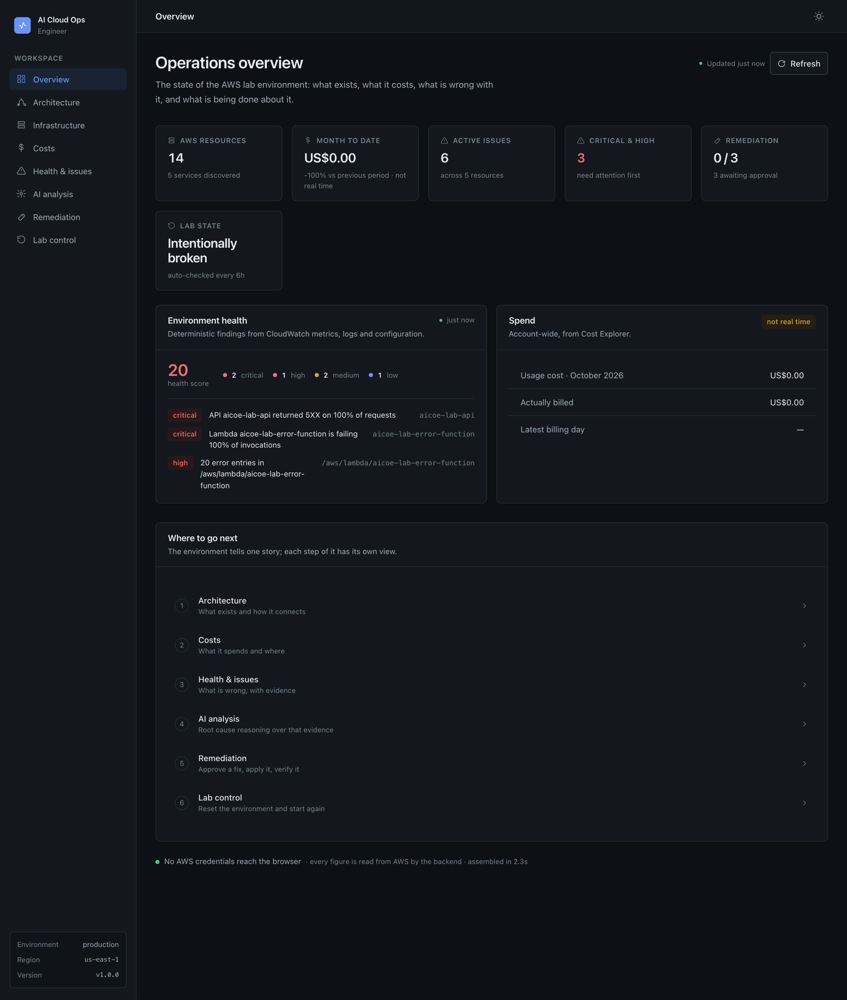
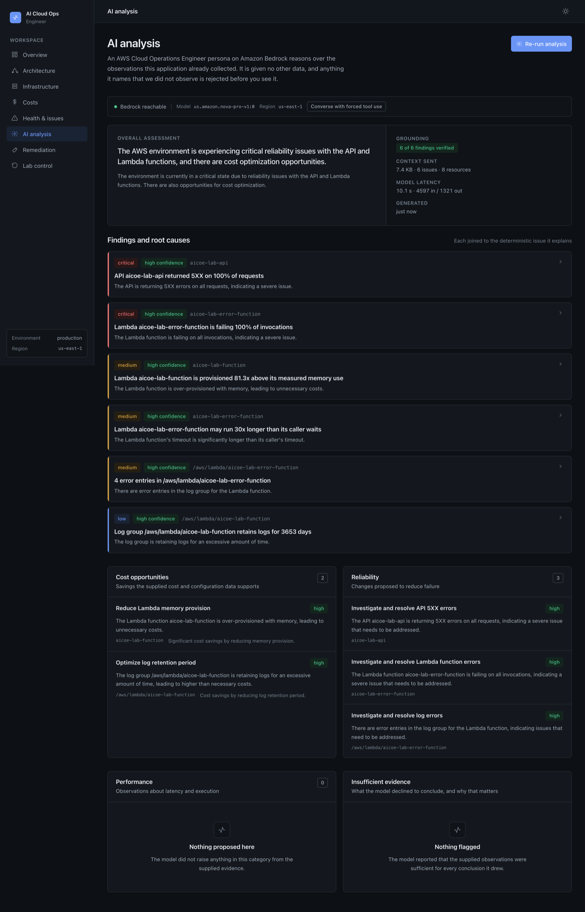
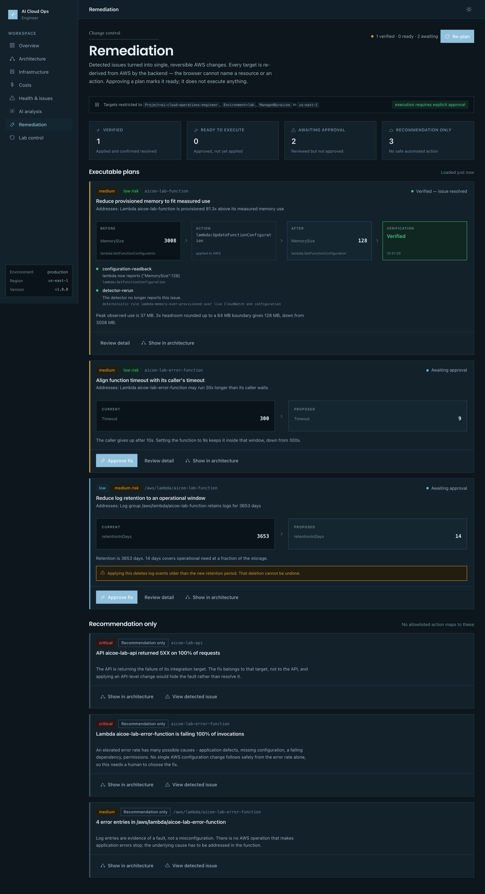
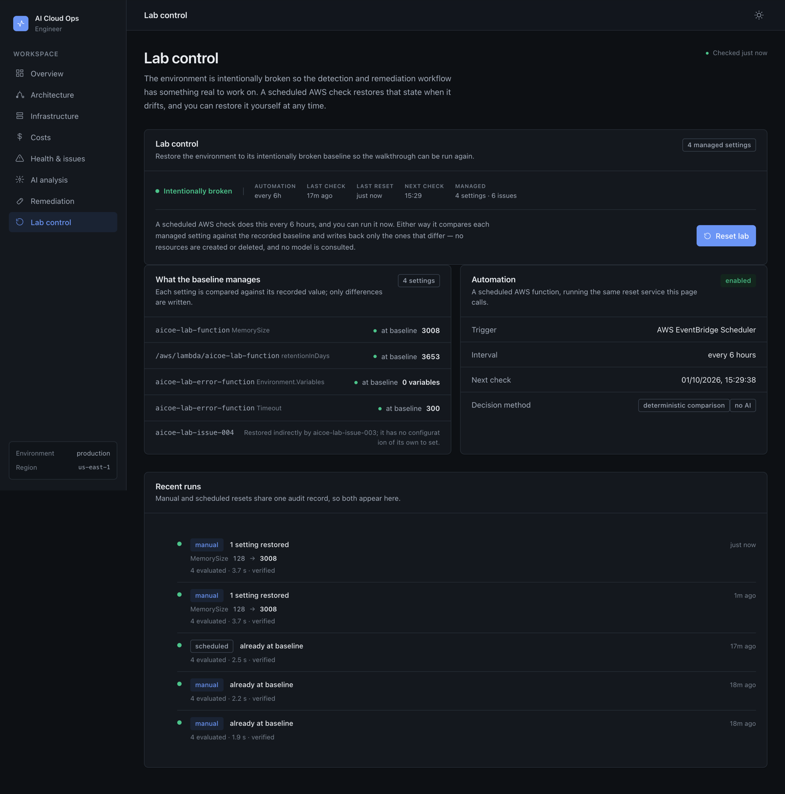

# AI Cloud Operations Engineer

An AI cloud operations engineer that reads a live AWS account, finds real problems, reasons
about them with Amazon Bedrock, and applies approved fixes to AWS — then proves the fix worked.

**Live application: [https://ai.tanseer.qd.je](https://ai.tanseer.qd.je)**



---

## The problem

Cloud operations is three separate jobs that nobody does together.

A monitoring tool tells you a metric crossed a line. A cost tool tells you the bill went up.
A diagram, if one exists, is out of date. None of them tells you *what is wrong, why, what it
costs, and what to do about it* — and none of them is trusted to actually change anything, so
a human reads three dashboards, forms a theory, and edits the configuration by hand.

The gap is not detection. It is the distance between detecting something and safely acting on it.

## The solution

One operational loop, running against a real AWS account:

```
Observe → Understand → Recommend → Approve → Remediate → Verify → Repeat
```

The application discovers the architecture, reads cost and CloudWatch health, detects problems
with deterministic rules, asks Amazon Bedrock to reason about the evidence, turns a finding into
a single reversible AWS change, waits for a human to approve it, applies it, reads AWS back to
prove it worked, and keeps a lab environment reproducible so the whole loop can be run again.

**What makes it different** is that it is all six at once — architecture, cost, operational
health, AI reasoning, safe remediation and verification — joined into one loop. It is not a chat
interface over the AWS API. The model never names a resource, never chooses an operation, and
never calls AWS. It reasons; the application acts, inside a boundary the model cannot widen.

## Key capabilities

| | |
|---|---|
| **Discovery** | Live inventory across Lambda, CloudWatch Logs, API Gateway, SSM and IAM, scoped by tags |
| **Architecture map** | Interactive topology where every edge comes from a field in a resource's own AWS configuration |
| **Cost analysis** | Cost Explorer usage *and* net-billed cost, daily trend, per-service breakdown, honest about billing lag |
| **Health & issue detection** | CloudWatch metrics and logs collected as facts, then six deterministic rules over them |
| **AI analysis** | Amazon Bedrock reasons over the collected evidence; every claim is checked back against it |
| **Remediation planning** | A detected issue becomes one allowlisted, reversible AWS change with a stated risk |
| **Approval** | A plan is inert until a human approves it; approving calls no AWS API at all |
| **Execution** | The approved operation is applied — the only code in the repo that mutates AWS |
| **Verification** | AWS is read back *and* the detector re-run; an HTTP 200 is never treated as success |
| **Lab reset** | Restores the intentionally broken baseline, idempotently |
| **Autonomous operation** | EventBridge Scheduler re-checks and restores the lab every 6 hours, with no model involved |

## Architecture

```
                                 User (browser)
                                       │  HTTPS
                                       ▼
                         AWS Amplify Hosting + CloudFront
                            ai.tanseer.qd.je  (ACM TLS)
                                       │  no AWS credentials ever reach here
                                       ▼
                         API Gateway  (HTTP API, $default)
                                       │
                                       ▼
                     Lambda  ·  aicoe-backend  (Express, Node 22)
                                       │
        ┌──────────────┬───────────────┼───────────────┬──────────────┐
        ▼              ▼               ▼               ▼              ▼
    Discovery      CloudWatch      Cost Explorer    Bedrock      DynamoDB
   Lambda · Logs   metrics+logs     usage + net    Nova Pro     plan store
   APIGW · SSM          │                            │          (approvals,
      IAM · Tags        │                            │           audit trail)
        └──────────────┴───────────────┬────────────┘
                                       ▼
                        Deterministic detection rules
                                       │
                                       ▼
                     Remediation engine  (allowlist → safety
                      gate → approval → execute → verify)
                                       │
                                       ▼
                              Lab resources only
                     aicoe-lab-function · aicoe-lab-error-function
                   their log groups · aicoe-lab-api · SSM baselines


          EventBridge Scheduler  ──rate(6 hours)──▶  Lambda
                                              aicoe-lab-autonomous-manager
                                                        │
                                                        ▼
                                         the same reset service as the UI
                                              (no Bedrock permission)
```

Everything shown is deployed. There is no queue, no cache tier, no VPC, and no always-running
compute anywhere in the system.

## AWS services used

| Service | Role |
|---|---|
| **AWS Amplify Hosting** | Serves the React build over CloudFront with a custom domain and ACM certificate |
| **Amazon API Gateway** (HTTP API) | Public HTTPS entry point, proxying everything to one Lambda |
| **AWS Lambda** | The Express backend, the scheduled lab manager, and the two lab functions |
| **Amazon Bedrock** | Root-cause reasoning over already-collected evidence |
| **Amazon CloudWatch** | Metrics and log events — the evidence behind every detected issue |
| **AWS Cost Explorer** | Usage and net-billed cost, daily trend, per-service breakdown |
| **AWS Systems Manager** Parameter Store | The lab's broken baseline, and the autonomous run audit record |
| **Amazon DynamoDB** | Remediation plans: the approval record and verification result |
| **Amazon EventBridge Scheduler** | Triggers the autonomous lab check |
| **AWS Resource Groups Tagging API** | One cross-service query for "what belongs to this lab" |
| **AWS IAM** | Five roles, each scoped to exactly what it does |
| **Amazon Route 53 + ACM** | DNS and TLS for the public domain |

## How Amazon Bedrock is used

Model: **`us.amazon.nova-pro-v1:0`**, fallback `us.amazon.nova-lite-v1:0`, via the **Converse API
with forced tool use** so the response is a schema-validated object rather than prose to parse.

The model was chosen by measurement, not preference: every candidate was invoked three times in
the deployment region before anything was hardcoded. Anthropic models failed 3/3 in this account
(`INVALID_PAYMENT_INSTRUMENT` — a Marketplace subscription the account cannot complete); Nova Pro
and Nova Lite succeeded 3/3. The model ID lives in configuration, never in source.

**What the model is given:** only observations this application already collected — the discovered
architecture, Cost Explorer figures, and the CloudWatch facts and deterministic findings. Roughly
7 KB of context. It has no AWS credentials, no tools, and no network.

**What the model cannot do:** name a resource, choose an AWS operation, set a parameter, or trigger
a call. Its output is checked against the discovered inventory, and any finding referencing an issue
id or resource the application did not itself observe is **rejected before display** — the UI shows
`6 of 6 findings verified` because that check actually ran.

**Why reasoning and not execution:** a model is good at explaining why three symptoms are one cause
and bad at being a safety boundary. So it does the first job, and a deterministic allowlist does the
second.



## Remediation safety model

Seven properties, each enforced in code rather than asserted in a prompt:

1. **The caller cannot name a target.** `POST /remediation/plan` accepts issue ids and nothing else.
   A body carrying `resourceArn`, `actionType` or `parameters` is rejected `400 caller_supplied_target`.
   Every target, operation and parameter is re-derived from AWS by the backend.
2. **Actions are allowlisted.** Three remediations exist — Lambda memory, Lambda timeout, log
   retention. An issue with no entry becomes *recommendation only*, with the reason stated.
3. **One file mutates AWS.** `services/remediation/executors.js`, four named functions, a frozen
   dispatch map, no default branch. There is deliberately no `executeAwsCommand(action, params)`.
4. **Seven safety checks** must all pass: resource discovered this request, name matches the lab
   convention, all three required tags present, region matches, action allowlisted, parameters in
   range, rollback available.
5. **Approval is inert.** Approving makes zero AWS calls — the response says `executionPerformed: false`,
   and the stored record says `awsCallsMade: 0`.
6. **Execution re-validates.** Every check from planning runs again against freshly read AWS state.
   Once approved, a plan is frozen: re-planning cannot swap parameters under an approval.
7. **Verification is independent.** AWS is read back *and* the detector is re-run. A successful API
   response is never, on its own, treated as success.



Blast radius, enforced by IAM rather than by convention: the backend role can write to exactly
**two Lambda functions, two log groups and one SSM parameter.** Nothing else in the account is
reachable by remediation, whatever the code or the model does.

## Lab and reset architecture

The environment under management is a deliberately broken lab: five seeded issues (over-provisioned
memory, 10-year log retention, a failing function, an API returning 5XX, a timeout 30× its caller's)
that produce six detected findings.

Each issue's intended broken value is recorded in SSM Parameter Store at lab setup. Reset compares
every managed attribute against that baseline and writes back **only what differs** — so resetting an
already-broken lab makes no AWS calls at all and reports `alreadyAtBaseline: true`. There is no
user-facing cooldown; concurrency is handled server-side, so simultaneous resets join one run.

The frontend cannot specify what to reset. The baseline is the only source of truth for what the
reset touches.

## Autonomous operation

EventBridge Scheduler invokes `aicoe-lab-autonomous-manager` every 6 hours. It calls the **same**
reset service as the button in the UI — one implementation, not two.

It is deterministic by construction: **its execution role holds no Bedrock permission at all**, so
the scheduled path cannot consult a model even if the code tried. Its writes are scoped by IAM to
the two lab functions, their two log groups, and one audit parameter. Each run records what it
found, what it changed and whether verification passed, and the dashboard reads that record — so the
UI can report autonomous runs it never saw.



## Demo workflow

Full script: **[docs/demo-script.md](docs/demo-script.md)** (3–5 minutes).

1. Open the dashboard — 14 real AWS resources, 6 detected issues, lab intentionally broken.
2. **Architecture** — the real topology; every edge traced to the AWS field it came from.
3. **Costs** — Cost Explorer usage vs. net billed, daily trend, per-service breakdown.
4. **Health & issues** — CloudWatch facts, and the rules that turn them into findings.
5. **AI analysis** — Bedrock reasons over that evidence; grounding check shown on screen.
6. **Remediation** — a finding becomes one reversible change: `3008 MB → 128 MB`.
7. **Approve** — state changes; AWS is untouched.
8. **Execute** — AWS actually changes.
9. **Verify** — before/after read back from AWS, detector re-run, issue resolved.
10. **Reset lab** — the issue comes back, and the loop can run again.

## Deployment architecture

| | |
|---|---|
| Frontend | AWS Amplify Hosting, manual deploy of the Vite build, SPA rewrite, security headers incl. CSP |
| Domain | `ai.tanseer.qd.je` — Route 53 CNAME, Amplify-managed ACM certificate |
| API | API Gateway HTTP API `aicoe-api`, `$default` route, `$default` stage, auto-deploy |
| Backend | Lambda `aicoe-backend` — Node 22, arm64, 1024 MB, 60 s, Express via `serverless-http` |
| Scheduler | EventBridge Scheduler `aicoe-lab-autonomous-check` → Lambda `aicoe-lab-autonomous-manager` |
| Region | `us-east-1` throughout |

The same Express app runs locally and on Lambda — `src/lambda/api.js` wraps `createApp()`, so there
is no second code path to keep in sync. Build with `npm run build:api` (esbuild, AWS SDK external).

Full detail: **[docs/deployment.md](docs/deployment.md)**.

## Local development

```bash
# API — http://localhost:4000
cd backend
cp .env.example .env
npm install
npm run dev

# Dashboard — http://localhost:5180
cd frontend
cp .env.example .env.local
npm install
npm run dev
```

The backend needs AWS credentials in the standard provider chain (`aws configure`, environment, or
a role) with read access to the lab resources. Without them the API starts and `/health` answers;
the analysis endpoints report the AWS error rather than inventing data.

Port 5180 rather than Vite's 5173, which collides with other local projects. `strictPort` is on, so
a clash fails loudly instead of drifting to a port the API's CORS list does not allow.

**Tests.** `cd backend && npm test` runs the safety suite — 16 cases over the remediation gate and the
action allowlist, using `node:test` with no dependencies and no AWS calls. It is deliberately pointed
at the one claim everything else rests on: that nothing outside the lab, and no action outside the
allowlist, can reach an executor. The rest of the system is validated against live AWS rather than
mocks, because mocked AWS responses would only prove the mocks agree with themselves.

## Environment configuration

Every variable enters the backend through `src/config/index.js` and nowhere else. **No credential is
ever one of them** — the AWS SDK resolves credentials at call time from the provider chain.

| Variable | Default | Purpose |
|---|---|---|
| `NODE_ENV` | `development` | Stack traces are returned only in development |
| `PORT` / `HOST` | `4000` / `127.0.0.1` | Local server binding |
| `AWS_REGION` | `us-east-1` | Workload region |
| `CORS_ORIGINS` | localhost dev ports | Comma-separated allowlist; no wildcard in production |
| `BEDROCK_MODEL_ID` | `us.amazon.nova-pro-v1:0` | Primary model |
| `BEDROCK_FALLBACK_MODEL_IDS` | Nova Lite, Claude Haiku | Tried in order if the primary is unavailable |
| `BEDROCK_REGION` | `AWS_REGION` | Model availability differs by region |
| `BEDROCK_MAX_TOKENS` | `4096` | Always set explicitly — an unset value reserves the model maximum against the account quota |
| `REMEDIATION_TABLE_NAME` | *(unset)* | DynamoDB plan store; falls back to a local JSON file when unset |
| `LAB_AUTOMATION_INTERVAL_HOURS` | `6` | Must match the EventBridge schedule |

Frontend: only `VITE_API_BASE_URL` and `VITE_APP_ENV`. Vite bundles only `VITE_`-prefixed values, and
everything in that bundle is public by definition — which is exactly why no secret is ever named there.
A production build with `VITE_API_BASE_URL` unset or non-HTTPS **fails**, rather than quietly shipping a
bundle that points at localhost.

**Version.** `version.js` at the repository root is the only place the version is written. The backend
imports it into its config (and so into `/health`); Vite injects it into the bundle, where the sidebar
shows it. Neither `package.json` carries a version field, so there is nowhere for a second number to
disagree.

## Security considerations

- **No AWS credentials in the browser.** The frontend has no AWS SDK dependency. Scanning the shipped
  bundle for credential patterns returns nothing, and the only external host it names is the API.
- **No secrets in the repository.** No access keys, tokens or private keys in the tree or in history.
  Every `.env` is gitignored; only `.env.example` templates are committed.
- **CORS is an allowlist.** `https://ai.tanseer.qd.je` plus local dev ports. A request from any other
  origin gets no `Access-Control-Allow-Origin` header at all.
- **Browser input is never trusted.** Resource ids, ARNs, operations and parameters supplied by a
  caller are rejected, not sanitised.
- **No `AdministratorAccess`, no `PowerUserAccess`, no managed policies.** Five roles, inline
  least-privilege policies. Seven list actions use `Resource: "*"` because AWS offers no resource-level
  permission for them; all seven are read-only. Every write is scoped to a named ARN.
- **Production errors reveal nothing.** Stack traces are returned only when `NODE_ENV=development`.
  No file paths, configuration or credentials appear in an error body.
- **Response headers:** HSTS, `X-Content-Type-Options`, `X-Frame-Options: DENY`, `Referrer-Policy`, and
  a CSP that pins `connect-src` to the API and carries a hash for the one inline script.
- **Logs carry no secrets.** Environment variable *names* are recorded in audit records; values never are.

## Cost considerations

Everything is serverless and scales to zero. **No NAT Gateway, no EC2, no RDS, no load balancer, no
VPC endpoints, no always-running compute** — verified across all 17 enabled regions.

| Component | Cost shape |
|---|---|
| Lambda, API Gateway, DynamoDB, EventBridge Scheduler | Per-request; effectively free at demo volume |
| Amplify Hosting | Per-GB served and per-build minute |
| CloudWatch Logs | 14-day retention on every application log group |
| Cost Explorer | **$0.01 per request** — responses are cached 15 minutes and the request count is reported in the UI |
| Bedrock | Per-token, and only on an explicit "Run analysis" — never on a page load |

The lab's own 10-year log retention and 3008 MB function are *deliberate* — they are the problems the
application exists to find.

## Known limitations

- **The lab is small by design.** Five seeded issues across Lambda, Logs and API Gateway. The
  detection rules and the remediation allowlist cover those shapes; a different environment would need
  new rules and new allowlist entries.
- **Three remediations are automated.** Error rates, 5XX responses and log errors are deliberately
  *recommendation only* — no single configuration change follows safely from them.
- **Cost attribution is a name correspondence**, not a causal claim. Cost Explorer reports per service,
  not per resource, and the UI says so rather than implying the over-provisioned function caused a line item.
- **Cost figures lag.** AWS finalises charges over roughly 24 hours. Nothing is presented as live, and
  early in a month — when AWS has posted nothing yet — the page shows a trailing 30-day window so the
  trend has real data while the headline stays month-to-date.
- **Analysis quality is bounded by the model.** Nova Pro is the most capable model this account can
  invoke. Its root-cause text is sound but terser than a frontier model's would be.
- **Lambda cold start** adds roughly 2–3 seconds to the first request after an idle period.
- **Single region, single account.** No cross-account or multi-region discovery.

## Repository layout

```
backend/src/
  config/        Every environment variable enters here and nowhere else
  routes/        Thin HTTP layer, one router per capability
  services/
    aws/         SDK client factory and the reusable lab-resource filter
    discovery/   One collector per AWS service
    architecture/  Relationship rules and the graph builder
    cost/        Cost Explorer queries, period maths, service mapping
    cloudwatch/  Bounded metric and log collection, log redaction
    health/      Fact model and the deterministic detection rules
    ai/          Bedrock client, analysis schema, context builder, grounding guard
    remediation/ Allowlist, safety gate, plan store, executors, verification
    lab/         Baseline reader, restore-target mapping, shared audit
  lambda/        API adapter and the scheduled lab manager
frontend/src/    React + Vite dashboard — never holds AWS credentials
infrastructure/  Lab sources, baselines, and every IAM policy document
docs/            Per-capability documentation, demo script, submission notes
```

## Documentation

| | |
|---|---|
| [Demo script](docs/demo-script.md) | The 3–5 minute walkthrough |
| [Submission](docs/submission.md) | Hackathon description and technical highlights |
| [Deployment](docs/deployment.md) | Architecture, IAM, build and deploy steps |
| [Lab environment](docs/lab-environment.md) | The five seeded issues |
| [Discovery](docs/discovery.md) · [Architecture graph](docs/architecture-graph.md) | Inventory and topology |
| [Cost analysis](docs/cost-analysis.md) · [Health analysis](docs/health-analysis.md) | Cost and CloudWatch |
| [AI analysis](docs/ai-analysis.md) | Model selection, schema, grounding |
| [Remediation planning](docs/remediation-planning.md) · [execution](docs/remediation-execution.md) | The safety model |
| [Lab reset](docs/lab-reset.md) · [Autonomous management](docs/autonomous-lab-management.md) | Reproducibility |
| [Design system](docs/design-system.md) | Tokens, themes, components |
| [Connecting an AI coding agent to AWS](docs/connecting-an-ai-coding-agent-to-aws.pdf) | Setup and verification of the AWS Agent Toolkit (PDF) |

## Credits

The hero photograph is by [Aaron Burden](https://unsplash.com/photos/aDjOUryr3bs) on
[Unsplash](https://unsplash.com), used under the Unsplash License and served from this
application's own origin. Display type is [Poppins](https://fonts.google.com/specimen/Poppins);
the eyebrow is [Lora](https://fonts.google.com/specimen/Lora) italic. The interface design
follows a [concept study by Mitanshu Mishra](https://dribbble.com/shots/17325342-Concept-UI-UX-Design-for-Travel-Blog)
— its palette, editorial type pairing and squared geometry, applied to an operations tool.

---

Built for the AWS Builder Center **Zero to Shipped** hackathon.
Region `us-east-1`. Lab resources carry `Project=ai-cloud-operations-engineer`,
`Environment=lab`, `ManagedBy=aicoe`.
